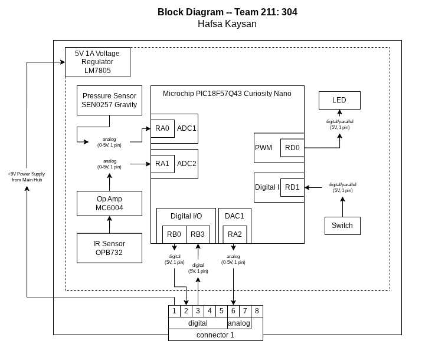

## Overview
The purpose of this block diagram is to organize and assign pins to the board monitoring water levels and pressure before selecting components, creating a schematic, and budgeting power for the board. Using a 9VAC 3A wall mounted power supply filtered through a 5V 1A regulator, +5V DC is used across the entire circuit. The sensors needed for this part of the device are a type of distance or pressure sensor for measuring water tank levels as analog data connected to an op amp to increase signal output (primary sensor for project) and a pressure sensor to check for any leaks or other failures in the irrigation system. The shared power pin is connector pin 1 which recieves the +9V and the shared ground pin is pin 8. A digital pin output and DAC output are sent to main board through connector pins 2 and 6 to relay the state of pressure (optimal/suboptimal) and the water level percentage calculated by the board respectively. A digital input pin is used to transmit a ready state from the main board to the water level and pressure board.

## Block Diagram 

PDF version ["here"](EGR304_individualblockdiagram.pdf)
