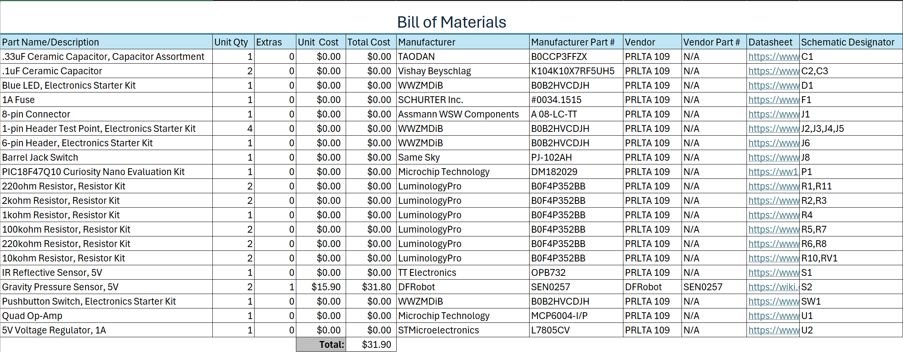

## Overview
In order to build this subsystem, the components listed below have been added to a prototype circuit which can be view in the ["Schematic"](https://hfsksn.github.io/04-Schematic/schematic/) subsection of the datasheet according to their reference designators. A vast majority of the items needed for the subsystem are provided by the EGR 304 course and ASU Peralta Building according to the course's Fall 2025 Parts List. Because the pressure sensor was the only component required for this design that was not provided by ASU, I placed a purchase request for two of that particular component from DFRobot in the case that the prototype fails. All components mounted directly on to the PCB are through-hole and the total of the BOM is below the individual budget of $60, as per the requirements of this class.

## Bill of Materials

**Figure 1:** Image of Bill of Materials, PDF version [*here*](EGR304_IndividualSubsystemBOM.pdf), XLSX version [*here*](EGR304_IndividualSubsystemBOM.xlsx)
