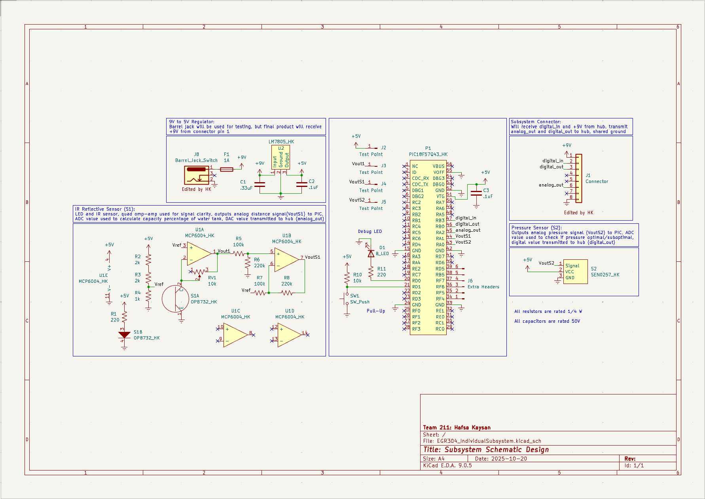

## Overview

This schematic is designed to support the indoor plant irrigation system by detecting water levels in an external water tank using an IR sensor and any leakage or extreme pressure in the irrigation tubing using a pressure transducer. This subsystem in the device is powered by a 9V AC power supply fed into a voltage regulator that produces 5V. This supplies power to the PIC18F57Q43 microcontroller which sends and recieves information to the sensors and communcates with the other microcontrollers in the system. A debugging LED and switch are used to confirm the microcontroller's functionality, a trans-impedance circuit using the MCP6004 quad operational amplifier to amplify the analog signal of the IR Sensor, and extra pin headers are included for debugging key areas and potential component additions. The layout of the components in the PCB design was made to facilitate ease of device testing and usage.

**Figure 1:** Showing schematic design for IR Sensor and Pressure Transducer connected to PIC with debugging elements, connectors, and power supply for testing.

## Resources

The schematic as a PDF download is available [*here*](EGR304_IndividualSubsystem.pdf), the Zip folder of the project [*here*](EGR304_IndividualSubsystem.zip), and the Zip folder of the custom symbols library [*here*](https://github.com/user-attachments/files/23014352/HK_HW2_Library.zip).
