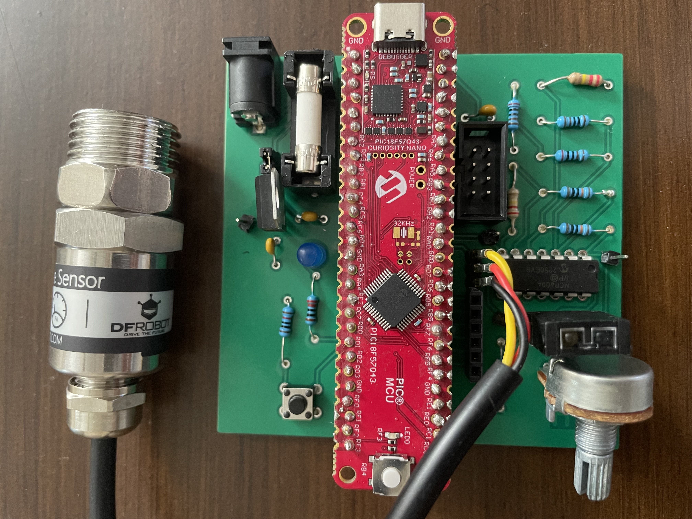
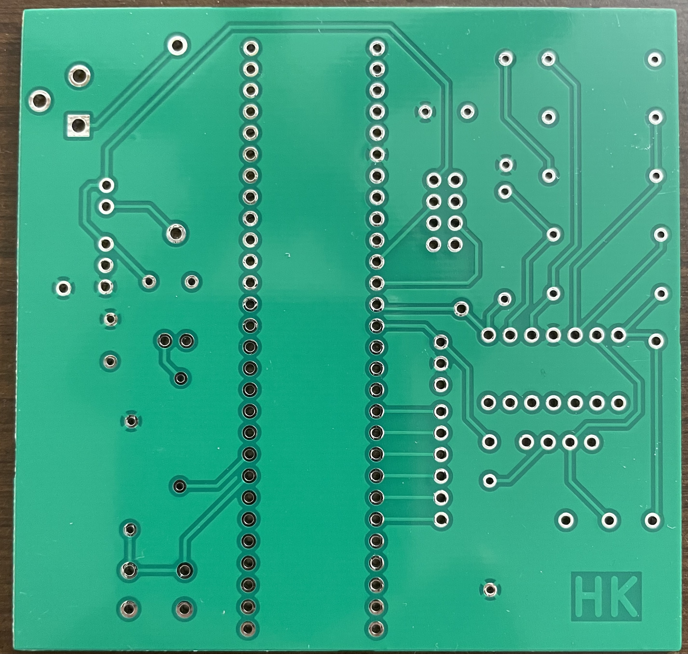

## PCB ECAD

**Figure 1:** PCB Design in KiCad with component values
___

**Figure 2:** Front 3D view of PCB in KiCAD
___

**Figure 3:** Back 3D view of PCB in KiCAD

## Final PCB

**Figure 4:** Printed PCB with components
___

**Figure 5:** Front view of printed PCB
___

**Figure 6:** Back view of printed PCB

## Resources

The Zip folder of the Gerber files [*here*](Hafsa211.zip), and the Zip folder of the custom footprint library [*here*](SubsystemLibrary.pretty.zip).
